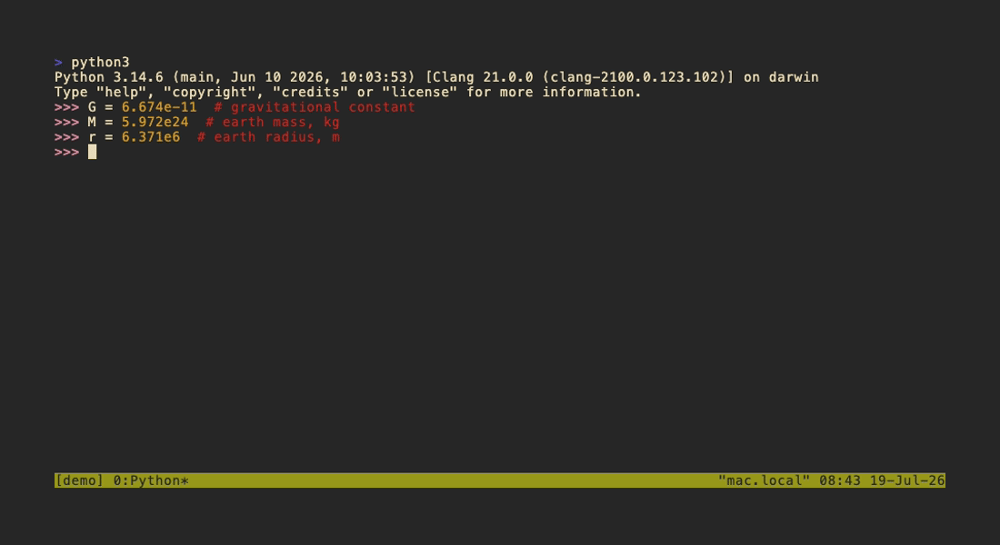

# boomerang


-lightgrey)


A tiny issue manager for tmux. Fling ideas into GitHub right when they occur and catch them again when it's time to build.

Good ideas often show up in the middle of other tasks (mid-refactor, mid-review, mid-standup).
Switch over to your browser to file them and you lose momentum on whatever you were working on.
Wait till you're done and you risk losing the idea.

Boomerang turns "I have to remember this idea for later" into a 3 second operation right from your terminal.
The idea becomes permanent immediately instead of a mental post-it that gets lost in the chaos of your puny human mind.

It's a standalone binary that tmux pops open on demand, in the same spirit as [rolomux](https://github.com/jeffdt/rolomux): executes right where you work, does its job, and gets out of the way again.

## Installation

> [!IMPORTANT]
> Boomerang shells out to the [GitHub CLI](https://cli.github.com) for everything rather than talking to GitHub directly. Install and authenticate `gh` first (`gh auth login`) if you haven't already; the steps below assume it's already working.

### 1. Install from Homebrew
```sh
brew install jeffdt/tap/boomerang
```

### 2. Add tmux keybind
Add a keybind to `~/.tmux.conf`, pointing at the installed binary:

```tmux
bind i display-popup -E -B -d "#{pane_current_path}" -w 84 -h 60% "exec boomerang"
```

> [!IMPORTANT]
> The `-d "#{pane_current_path}"` matters: without it, `display-popup` doesn't reliably inherit the current pane's working directory, so `gh` can't determine the repo you're working in.

> [!TIP]
> The popup dimensions are a starting point; adjust `-w`/`-h` to taste.

### 3. Reload tmux and launch it!
Reload tmux with `tmux source-file ~/.tmux.conf` and press `prefix + i`.

### 4. (Recommended) Add a second binding for quick-capture
Boomerang also has a minimalist "capture" mode: it skips fetching the issue list entirely, so there's nothing to wait on and you can start typing your idea the instant the popup opens.

To set it up, create a second binding to launch boomerang in capture mode.

```tmux
bind I display-popup -E -B -d "#{pane_current_path}" -w 84 -h 4 "exec boomerang --capture"
```

Then reload again with `tmux source-file ~/.tmux.conf` and try it with `prefix + I`!

## How it works

- **Minimal setup.** Auto-detects the repo from the current directory via `gh`'s own git-remote detection, no config or `--repo` flag needed.
- **Instant open.** Just kidding, it takes a second to fetch issues and labels. But you get a sweet loading animation while it runs to keep you distracted.
- **One network call.** Fetches all open issues (including body and labels) in a single `gh issue list` call, so the description pane never needs a follow-up round trip.
- **Non-blocking edits.** Create and edit submissions run in the background with an in-place pending indicator, then refresh the list when `gh` returns.
- **Built on `gh`.** All GitHub interaction shells out to the `gh` CLI, which must be installed and authenticated (`gh auth login`).

## Keys

| Key | Action |
| --- | --- |
| `j`/`k` (or `↓`/`↑`) | Move the cursor |
| `h` | Hide/show the description pane (shown by default) |
| `/` | Fuzzy search by title (`Enter`/`Esc` to return to the list) |
| `a` | Cycle state filter: open → closed → all |
| `Space` | Check/uncheck the selected issue for a multi-copy |
| `c` | Create: title + body + label picker |
| `Enter` / `e` | Edit the selected issue's title/body/labels |
| `x` | Close the selected issue (y/n confirm) |
| `o` | Open the selected issue in your browser |
| `y` | Copy `#123` to the clipboard (or every checked issue, comma-joined, if any are checked) |
| `Y` (shift+y) | Copy a markdown link to the clipboard |
| `Ctrl-y` | Copy the plain URL to the clipboard |
| `R` (shift+r) | Switch to a different repo |
| `,` | Open Settings |
| `?` | Reveal the shortcut legend, if "Show shortcuts" is set to On demand |
| `q` / `Esc` | Quit |

> [!NOTE]
> `y`/`Y`/`Ctrl-y` only work on macOS, because they shell out to `pbcopy`.

Inside the create/edit form: `Tab`/`Shift+Tab` moves between Title/Body/Labels,
`Space` toggles a label when the Labels field is focused, and `Enter` advances
Title → Body → submit (submitting from the Labels field).

## Settings

Press `,` to open Settings, a small view of picker-wide preferences. `j`/`k`
(or `↓`/`↑`) moves between rows, `Enter`/`Space`/`h`/`l` toggles the selected
row, and `q`/`Esc` returns to the list.

| Setting | Default | Description |
| --- | --- | --- |
| Exit popup after copy/yank | Off | When on, a successful `y`/`Y`/`Ctrl-y` copy closes the popup immediately instead of staying open. |
| Zebra striping | On | Dims every other row in the issue list to make scanning easier. Uses your terminal's own faint/dim rendering rather than a fixed color, so it adapts to your terminal theme. |
| Show shortcuts | Always | When set to On demand, the list's footer shortcut legend stays collapsed to a `? shortcuts` nudge until you press `?`; it starts collapsed again next launch. |

## Quick capture



`boomerang --capture` skips the `gh` issue fetch entirely and opens straight to the title-only quick-create prompt (`Enter` to create, `Esc` to cancel), then exits.
This is extra handy when bound to its own key (see the `bind I` example above) for firing off an issue with minimal disruption to your work.
`boomerang --capture-full` does the same but opens the full form instead, if you prefer to capture body + label upfront at idea-time.

## Picking it back up


Catching an idea is only half the point; getting it back out is the other half.
Mid-task and need an issue number? Pop the picker open, `y` copies `#123` to the clipboard, and it closes right back into whatever you were doing.
Paste straight into a commit message, a PR description, or - as above - a `claude -p` prompt to go straight from "I filed this" to "an agent is working on it."

## Fleshing it out


The point of capturing an idea in three seconds is that you don't have to flesh it out right then.
`Enter`/`e` opens the full edit form on any issue - title, body, and labels - so when you do have time, you can find it again with `/` and fill in the rest without ever having lost it in the meantime.

## Diagnostics

Run `boomerang --doctor` from the target repo to print cwd, git remote, `gh` auth, detected GitHub repo, token-env, and diagnostic logging state.

`gh` follows normal environment precedence. If tmux exports `GITHUB_TOKEN`, that token overrides the `gh` keyring account. For personal repos where your shell has a work token, launch with:

```sh
env -u GITHUB_TOKEN boomerang
```

Opt-in command diagnostics by setting `BOOMERANG_LOG=1`.
Logs go to `~/.cache/boomerang/boomerang.log` by default, or to `BOOMERANG_LOG_PATH` when set.
Logs include sanitized `gh` argv, elapsed milliseconds, exit status, stdout byte count, and stderr.
Issue titles and bodies passed to `gh` are redacted.

## Design philosophy

boomerang is designed to be reached for constantly and thought about rarely.
Ideas come quickly but are lost even quicker; boomerang's job is to be ready and waiting to capture your ideas the moment they occur.
It is only running when you're actively using it.
It is not responsible for your commits, PRs, releases, or builds.
Its only job is to package your ideas into issues and help you find them again later.
It should be fun to use and easy on the eyes, and should never clash with the aesthetics of your terminal.

## Disclaimer

This project was fully vibe coded. Use at your own risk.

## License

MIT
